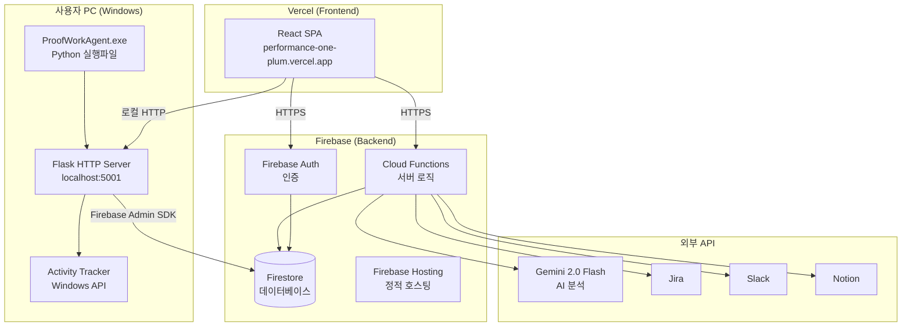
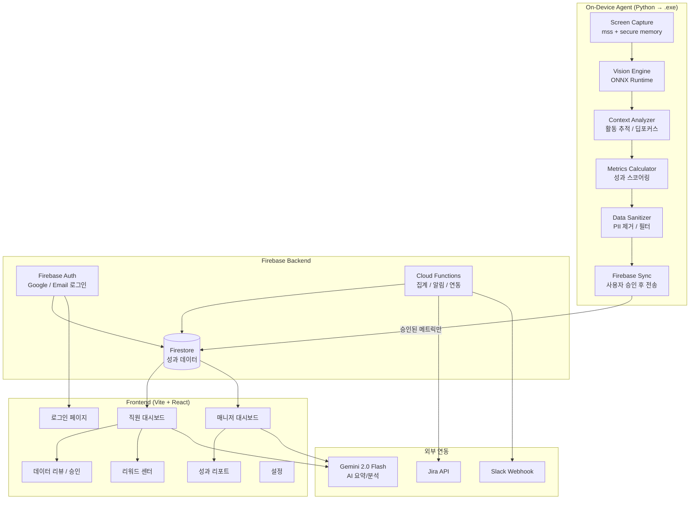

# ProofWork — On-Device AI 기반 자율 성과 증명 및 관리 솔루션

## 배포 아키텍처 (Production)



## 배포 전략

| 컴포넌트 | 플랫폼 | 배포 방법 | URL |
|---------|-------|---------|-----|
| **Frontend** | Vercel | Git push (자동 배포) | https://performance-one-plum.vercel.app |
| **Backend API** | Firebase Functions | `firebase deploy --only functions` | asia-northeast3-performance-fefc0.cloudfunctions.net |
| **Database** | Firestore | 자동 동기화 | Firebase 콘솔 |
| **Auth** | Firebase Auth | 자동 동기화 | Firebase 콘솔 |
| **On-Device Agent** | 사용자 PC | .exe 다운로드 → 실행 | localhost:5001 |

## On-Device Agent 배포 흐름

```
1. 개발
   └─> Python 코드 작성 (on-device-agent/)

2. 빌드
   └─> python build_exe.py
   └─> PyInstaller → ProofWorkAgent.exe

3. 배포
   └─> GitHub Releases 업로드
   └─> 사용자 다운로드
   └─> .exe 실행 (Python 설치 불필요)

4. 실행
   └─> Flask 서버 시작 (localhost:5001)
   └─> Windows 트레이 아이콘
   └─> 대시보드에서 [추적 시작] 버튼 클릭
```

## 아키텍처 개요 (Technical)



## 프로젝트 구조

```
ProofWork/
├── frontend/                       # Vite + React 프론트엔드 (Vercel)
│   ├── src/
│   │   ├── components/             # 재사용 UI 컴포넌트
│   │   │   ├── dashboard/          # MetricCard, TeamOverview, BottleneckAlert
│   │   │   ├── charts/             # FocusChart, GoalAlignmentChart, EfficiencyChart
│   │   │   ├── review/             # DataReviewCard
│   │   │   └── report/             # ReportPreview
│   │   ├── pages/                  # 라우트별 페이지
│   │   ├── services/               # Gemini, Firestore, Analytics 서비스
│   │   ├── hooks/                  # 커스텀 훅 (usePerformance)
│   │   ├── contexts/               # AuthContext
│   │   ├── config/                 # Firebase 설정
│   │   ├── types/                  # TypeScript 타입 정의
│   │   └── styles/                 # 글로벌 CSS (Tailwind)
│   ├── package.json
│   ├── vite.config.ts
│   └── tsconfig.json
│
├── backend/                        # Firebase 백엔드
│   ├── functions/
│   │   └── src/index.ts            # Cloud Functions (6개)
│   │       ├── onPerformanceSubmit      # 성과 제출 시 팀 집계
│   │       ├── aggregateTeamDashboard   # 팀 대시보드 갱신
│   │       ├── syncJira                 # Jira 웹훅
│   │       ├── sendSlackNotification    # Slack 웹훅
│   │       ├── mapMetricsToGoals        # 목표 매핑
│   │       └── notionProxy              # Notion API 프록시
│   ├── firebase.json
│   ├── firestore.rules
│   └── firestore.indexes.json
│
├── on-device-agent/                # On-Device Python Agent (.exe 배포)
│   ├── capture/                    # 스크린 캡처 모듈
│   │   └── screen_capture.py
│   ├── analyzer/                   # 비전/컨텍스트 분석
│   │   ├── vision_engine.py
│   │   ├── context_analyzer.py
│   │   └── metrics_calculator.py
│   ├── privacy/                    # 프라이버시 관리
│   │   └── data_sanitizer.py
│   ├── sync/                       # Firebase 동기화
│   │   └── firebase_sync.py
│   ├── models/                     # ONNX 모델 디렉토리
│   ├── config.py                   # 설정
│   ├── server.py                   # Flask HTTP 서버
│   ├── tracker.py                  # Windows 활동 추적
│   ├── firebase_client.py          # Firebase Admin SDK
│   ├── metrics_engine.py           # 메트릭 계산 엔진
│   ├── requirements.txt            # Python 패키지
│   ├── agent.spec                  # PyInstaller 빌드 설정
│   └── build_exe.py                # 실행파일 빌드 스크립트
│
└── docs/
    ├── ARCHITECTURE.md             # 이 문서
    ├── PROJECT_REVIEW.md           # 프로젝트 리뷰
    └── DEPLOYMENT.md               # 배포 가이드
```

## 데이터 파이프라인

### 1단계: 스크린 캡처 (On-Device)
- **도구**: `mss` (크로스플랫폼 스크린샷)
- **간격**: 기본 30초, CPU 부하에 따라 동적 조절 (30초~120초)
- **보안**: 캡처 후 즉시 메모리에서만 처리, `secure_delete_frame()`으로 0 초기화

### 2단계: 비전 분석 (On-Device)
- **엔진**: ONNX Runtime (CPU/GPU 자동 선택)
- **모델**: MobileNetV3-Small → 13가지 장면 분류
- **Fallback**: 모델 없을 시 색상 히스토그램 기반 간이 분류기
- **OCR**: 텍스트 영역 탐지 → 컨텍스트 키워드 추출

### 3단계: 컨텍스트 분석 (On-Device)
- 소프트웨어 사용시간 집계 (카테고리별, 앱별)
- 컨텍스트 전환 횟수/비율 계산
- 딥 포커스 구간 탐지 (20분+ 무중단 동일 카테고리)
- 프레임 차분 기반 입력 밀도 추정

### 4단계: 프라이버시 필터링 (On-Device)
- PII 자동 탐지 및 마스킹 (이메일, 전화번호, 주민번호, 카드번호 등)
- 민감 키워드 윈도우 타이틀 마스킹
- 동의 수준에 따른 데이터 단계적 필터링
- 감사 로깅 (Audit Trail)

### 5단계: 메트릭 계산 (On-Device)
```
종합 점수 = 산출물(30%) + 효율성(25%) + 몰입도(25%) + 목표정렬도(20%)
```

### 6단계: 사용자 승인 → Firebase 동기화
- 큐잉 → 사용자 리뷰 → 승인/거부 → Firestore 업로드
- 실패 시 자동 재시도 (최대 3회)
- 로컬 큐 영구 저장 (`~/.proofwork/sync_queue.json`)

## 스코어링 공식

### 몰입도 (Focus Score)
```
Focus = 0.35 × (1 - CSR/CSR_max) + 0.40 × DFR + 0.25 × (ID/ID_max)

CSR: 컨텍스트 전환율 (회/분)
CSR_max: 3.0
DFR: 딥 포커스 비율 (딥포커스 시간 / 활성 시간)
ID: 입력 밀도 (이벤트/분)
ID_max: 120.0
```

### 목표 정렬도 (Goal Alignment)
```
GoalAlignment = Σ(aligned_usage% / total_usage% × goal_weight) / Σ(goal_weight)
```

### 리워드 포인트
```
points = overall_score × 10 × tier_multiplier

tier_multiplier:
  Legend(95+): ×2.0
  Master(85-94): ×1.6
  Specialist(75-84): ×1.3
  Achiever(60-74): ×1.1
  Explorer(0-59): ×1.0
```

## 리워드 티어 시스템

| 티어 | 점수 범위 | 배수 | 아이콘 |
|------|-----------|------|--------|
| Legend | 95–100 | ×2.0 | 🏆 |
| Master | 85–94 | ×1.6 | 💎 |
| Specialist | 75–84 | ×1.3 | 🔥 |
| Achiever | 60–74 | ×1.1 | ⭐ |
| Explorer | 0–59 | ×1.0 | 🌱 |

## Cloud Functions

| 함수 | 트리거 | 설명 |
|------|--------|------|
| `onPerformanceSubmit` | Firestore onCreate | 성과 제출 시 리워드 계산 + 알림 |
| `aggregateTeamDashboard` | 매일 00:30 (KST) | 팀 단위 일일 집계 |
| `syncJira` | HTTP POST | Jira 이슈 데이터 동기화 |
| `sendSlackNotification` | HTTP POST | Slack 알림 발송 |
| `mapMetricsToGoals` | HTTP POST | 메트릭 → OKR/KPI 자동 매핑 |

## 역할 기반 접근 제어 (RBAC)

| 기능 | Employee | Manager | HR Admin | Super Admin |
|------|----------|---------|----------|-------------|
| 내 대시보드 | ✅ | ✅ | ✅ | ✅ |
| 데이터 리뷰/승인 | ✅ | – | – | – |
| 팀 대시보드 | – | ✅ | ✅ | ✅ |
| 성과 리포트 | – | ✅ | ✅ | ✅ |
| 리워드 센터 | ✅ | ✅ | ✅ | ✅ |
| 시스템 설정 | – | – | ✅ | ✅ |

## 보안 및 프라이버시

### Privacy-by-Design 원칙
1. **로컬 우선**: 모든 영상/스크린 데이터는 디바이스에서만 처리
2. **최소 수집**: 필요 최소한의 메트릭만 서버 전송
3. **사용자 통제**: 데이터 승인/거부 권한은 항상 사용자에게
4. **투명성**: 감사 로그로 모든 데이터 처리 추적 가능
5. **삭제 권한**: GDPR "잊힐 권리" 지원 (`clear_all_data()`)

### 동의 수준별 데이터 처리
| 수준 | 수집 범위 | 서버 전송 |
|------|-----------|-----------|
| None | 수집 안 함 | 전송 안 함 |
| Basic | 집계 점수만 | 점수 + 업무시간 |
| Standard (기본) | 소프트웨어 사용현황 포함 | 점수 + 사용현황 |
| Full | 텍스트 컨텍스트 포함 | 전체 메트릭 |

## 기술 스택 요약

| 레이어 | 기술 | 비고 |
|--------|------|------|
| Frontend | Vite + React 19 + TypeScript | Tailwind CSS, Recharts |
| Backend | Firebase (Auth, Firestore, Functions) | asia-northeast3 리전 |
| AI - Cloud | Gemini 2.0 Flash | 요약, 리뷰, 병목 분석 |
| AI - On-Device | ONNX Runtime | 장면 분류, OCR |
| Agent | Python 3.10+ | mss, opencv, structlog |
| 패키지 관리 | npm (frontend), pip (agent) | |

## 실행 방법

### 프론트엔드
```bash
cd frontend
npm install
npm run dev        # 개발 서버 (포트 5173)
npm run build      # 프로덕션 빌드
```

### 백엔드
```bash
cd backend
npm install
firebase emulators:start   # 로컬 에뮬레이터
firebase deploy             # 프로덕션 배포
```

### On-Device Agent
```bash
cd on-device-agent
pip install -r requirements.txt

python main.py --demo                  # 데모 모드
python main.py --consent standard      # 실시간 분석
python main.py --sync                  # 대기 데이터 동기화
```
